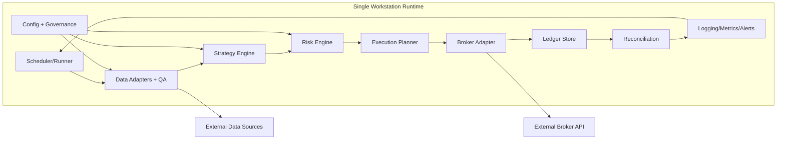
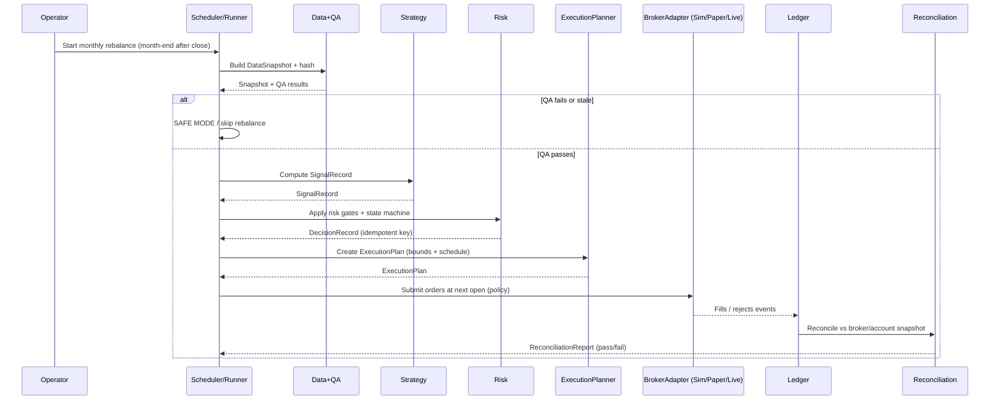
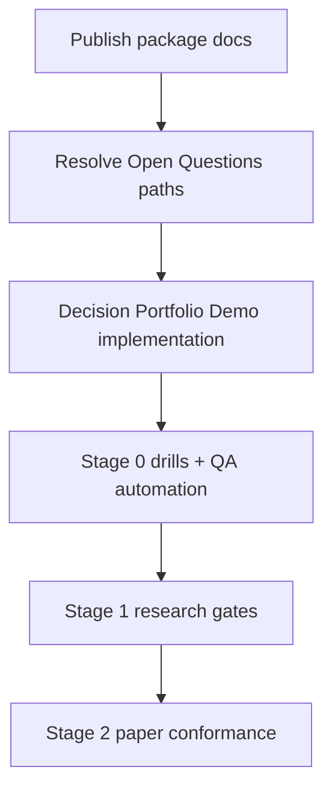

# Ironclad Planning + Software Architecture Package (v2.1)

**Status:** Draft (planning-only; Stage 1)

**Authoritative plan sources:**
- `docs/plan/PLAN_PROPOSAL_v2.1.md` (integrated plan)
- `docs/quality/ACCEPTANCE_CRITERIA_v2.1.md` (stage gates)
- `docs/config/CONFIG_SCHEMA_CONCEPTUAL_v2.1.md` (conceptual config + change classification)
- `docs/ops/RUNBOOK_v2.1.md` (operating procedures)
- `docs/validation/VALIDATION_MATRIX_v2.1.md` + `docs/validation/TRACEABILITY_INDEX_v2.1.md` (traceability)
- `docs/validation/OPEN_QUESTIONS_v2.1.md` (blockers)
- `docs/risk/RISK_REGISTER_v2.1.md` (risk + drills)

**Repo constraints (binding):** planning-only until Stage 2 on `main` (`docs/quality/STAGE_STATUS.md`; `docs/governance/BRANCHING_STRATEGY.md`).

---

## 1) Executive Summary

### Current state
- The project is a **planning-first** repository for a **personal, locally-run** systematic trading system with an MVP locked to **Cross‑Asset Momentum Rotation (monthly)** (`README.md`; `docs/plan/PLAN_PROPOSAL_v2.1.md`).
- The system concept is already decomposed into a pipeline: **Data → Strategy → Risk → Execution → Ledger/Reconciliation → Reporting/Observability** (`docs/plan/PLAN_PROPOSAL_v2.1.md` §1.2; `docs/architecture/SYSTEM_OVERVIEW.md`).
- The project is at **Stage 1 (Backtest realism + robustness)**; code changes are not permitted on `main` until Stage 2 (`docs/quality/STAGE_STATUS.md`).

### Key risks (highest leverage)
- **R‑01 Lookahead bias** via daily bar timestamp semantics and data availability assumptions (`docs/risk/RISK_REGISTER_v2.1.md`; `docs/quality/ACCEPTANCE_CRITERIA_v2.1.md` invariants + Stage 0).
- **R‑02 Overfitting** via uncontrolled search/parameter degrees of freedom; requires CSCV/PBO gating (`docs/risk/RISK_REGISTER_v2.1.md`; `docs/plan/PLAN_PROPOSAL_v2.1.md` §4.2).
- **R‑04 Execution cutoffs / rejects**, especially if auction orders are used (timing ADR 0004; runbook; risk register).
- **R‑06 Single workstation ops risk**: missed runs, restore failures (`docs/risk/RISK_REGISTER_v2.1.md`; `docs/ops/RUNBOOK_v2.1.md`).

### Key architectural recommendations (actionable)
1. **Contracts-first architecture** around immutable, hash-addressed records: `DataSnapshot`, `SignalRecord`, `DecisionRecord`, `ExecutionPlan`, `TradeLedger`, `ReconciliationReport` (`docs/plan/PLAN_PROPOSAL_v2.1.md` §5.1).
2. **Idempotent monthly rebalance** keyed by `(strategy_version, rebalance_month, snapshot_hash)` (invariant in `docs/config/CONFIG_SCHEMA_CONCEPTUAL_v2.1.md`).
3. **Strict module boundaries + replaceability**: data provider adapters and broker adapters must be swappable without changing strategy/risk logic.
4. **Dual-path runtime** to support low-cost proof-of-concept *without* weakening the eventual live system:
   - Path A: **Decision Portfolio Demo** (no broker funds): Simulated broker + free/legal EOD data + deterministic decision ledger.
   - Path B: **Paper/live conformance** (Stage 2+): real broker adapter + reconciliation vs broker statements/positions.

### Immediate next steps (to unblock parallel work)
- Resolve P0 Open Questions by turning each into a decision memo + validation suite entry (see `docs/validation/OPEN_QUESTIONS_v2.1.md`).
- Publish the split package docs under `docs/package/` and link from `docs/INDEX.md`.
- Create an implementation repository **separate from this planning repo** for the Decision Portfolio Demo path (keeps Stage 1 compliance).

---

## 2) Project Understanding

### Problem statement and target outcomes (as written)
- Build a **personal, locally-run systematic trading system** whose MVP is **Cross‑Asset Momentum Rotation (monthly)** with:
  - a single monthly decision point (post month-end close)
  - next-open execution by default (Close→Open)
  - basic risk controls and SAFE MODE/HALT semantics
  - research integrity: time-frontier enforcement + CSCV/PBO gating + crash stress tests
  - strong traceability: every trade traces to immutable inputs (`docs/plan/PLAN_PROPOSAL_v2.1.md` §1–§5; `docs/quality/ACCEPTANCE_CRITERIA_v2.1.md`).

### Stakeholders and users (confirmed vs unknown)
- **Operator / end-user (confirmed):** single workstation operator executing a monthly rebalance (`docs/ops/RUNBOOK_v2.1.md`).
- **Planning/Research Lead (confirmed role):** maintains plan coherence, evidence standards, and stage progression (`GOVERNANCE.md`).
- **Unknown:** whether any external users exist (none stated).

### Value delivery
- Deliver value through a repeatable cycle:
  1) acquire/validate end-of-day data,
  2) compute deterministic signals,
  3) produce a decision record and executable plan,
  4) execute with safeguards,
  5) reconcile and generate a pass/fail report,
  6) preserve an auditable ledger.

### In-scope vs out-of-scope boundaries (explicit)
**In-scope (MVP):** cross-asset momentum rotation monthly; basic risk controls; deterministic audit trail; safe operations (`docs/plan/PLAN_PROPOSAL_v2.1.md` §1.1).

**Out-of-scope (MVP non-goals):** intraday/HFT, options, leverage targeting, optimization/ML forecasting, multi-strategy ensembles, discretionary overrides except emergency HALT (`docs/plan/PLAN_PROPOSAL_v2.1.md` §1.1).

---

## 3) Requirements Model

> Note: IDs below are **requirements extracted from the v2.1 plan and supporting artifacts**. Items marked **(New constraint: operator-provided)** originate from the sponsor’s instruction and may constrain the ability to meet Stage 2/3 gates as currently written; they are tracked as constraints/assumptions with validation methods.

### Functional requirements (FR)
- **FR-001 Monthly decision cadence**: exactly one decision point per month, computed after last trading day close; execute next open by default (`docs/plan/PLAN_PROPOSAL_v2.1.md` §1.1, §3.1).
- **FR-002 Deterministic signal**: cross-sectional momentum score (default 12-month trailing total-return proxy); rank and select top eligible asset (`docs/plan/PLAN_PROPOSAL_v2.1.md` §2.2).
- **FR-003 Defensive fallback**: if no assets eligible, rotate to a defensive asset per config (`docs/plan/PLAN_PROPOSAL_v2.1.md` §2.2; config schema §2.2).
- **FR-004 Data QA gates**: reject stale/missing last-close data; enforce data integrity checks prior to decision (`docs/plan/PLAN_PROPOSAL_v2.1.md` §2.3; `docs/ops/RUNBOOK_v2.1.md` §3.2).
- **FR-005 Time-frontier enforcement**: signals may only use data available at the decision timestamp (`docs/plan/PLAN_PROPOSAL_v2.1.md` §4.1; `docs/quality/ACCEPTANCE_CRITERIA_v2.1.md` invariant #1).
- **FR-006 Overfitting control gate**: compute CSCV/PBO during research; reject configs exceeding threshold (`docs/plan/PLAN_PROPOSAL_v2.1.md` §4.2; Acceptance Stage 1).
- **FR-007 SAFE MODE/HALT state machine** with explicit triggers (data QA fail, cutoff risk, repeated rejects, reconciliation breaks, drawdown breach) (`docs/config/CONFIG_SCHEMA_CONCEPTUAL_v2.1.md` §2.5; `docs/ops/RUNBOOK_v2.1.md` §2; Acceptance invariant #4).
- **FR-008 ExecutionPlan generation**: create explicit orders with safety bounds and cutoff schedule prior to submission (`docs/plan/PLAN_PROPOSAL_v2.1.md` §5.1; config schema §2.4).
- **FR-009 Ledger append-only**: persist fills/fees and retain immutable evidence trail (`docs/plan/PLAN_PROPOSAL_v2.1.md` §5.1; Validation Matrix “Ledger”).
- **FR-010 Reconciliation report**: compare ledger vs broker/account state; produce pass/fail and categorized breaks (`docs/plan/PLAN_PROPOSAL_v2.1.md` §5.1; `docs/ops/RUNBOOK_v2.1.md` §3.5; Acceptance Stage 2).

### Non-functional requirements (NFR)
- **NFR-001 Planning-only compliance**: until Stage 2 is passed on `main`, changes must be limited to `docs/**` and `.github/**` (`docs/quality/STAGE_STATUS.md`; `docs/governance/BRANCHING_STRATEGY.md`).
- **NFR-002 Determinism + replayability**: given the same snapshot+config, outputs are identical (System Overview; plan §5.2; Acceptance invariants #2–#3).
- **NFR-003 Idempotent scheduling**: safe to re-run jobs without double trading (`docs/ops/RUNBOOK_v2.1.md` §1).
- **NFR-004 Auditability + provenance**: each order traces to DecisionRecord + snapshot hash (`docs/quality/ACCEPTANCE_CRITERIA_v2.1.md` invariant #2).
- **NFR-005 Security (secrets isolation)**: never commit secrets; least privilege; prepare for tamper-evident logs once implementation begins (`SECURITY.md`).
- **NFR-006 Local-first operations**: bounded runtime on a single workstation; offline backups; restore drills (`docs/plan/PLAN_PROPOSAL_v2.1.md` §5.2; `docs/ops/RUNBOOK_v2.1.md` §5).
- **NFR-007 Observability**: structured logs, run IDs, staleness + reconciliation metrics; local-only alert channels (`docs/plan/PLAN_PROPOSAL_v2.1.md` §5.2; config schema §2.8).

### Constraints
- **C-001 MVP locked**: no intent drift; MVP remains Cross‑Asset Momentum Rotation (monthly) (`README.md`; `AGENTS.md`).
- **C-002 Strategy change governance**: changes to universe/signal/cadence/defensive logic require `strategy_version` bump + revalidation (`GOVERNANCE.md`; config schema §3).
- **C-003 No large binaries committed**: archives and PDFs must not be committed (`docs/governance/BRANCHING_STRATEGY.md`; `.gitignore`).
- **C-004 Cost constraint (New constraint: operator-provided)**: proof-of-concept must avoid paid services and avoid injecting trading funds.

### Assumptions and Unknowns (each includes verification method)
- **U-001 Broker + account type (P0)**: not yet selected (`docs/validation/OPEN_QUESTIONS_v2.1.md`).
  - Verify via: broker docs + paper tests + ADR 0002 acceptance.
- **U-002 Data provider + adjustment/timestamp semantics (P0)**: not yet selected (`OPEN_QUESTIONS`).
  - Verify via: Stage 0 availability suite + corporate action QA + ADR 0003 acceptance.
- **U-003 Venue + broker cutoffs (P0)**: not verified for chosen order types (`OPEN_QUESTIONS`; ADR 0004).
  - Verify via: exchange/broker primary sources in `docs/references/PRIMARY_SOURCES.md` + paper rejects analysis.
- **U-004 ETF universe list (P0)**: not finalized (`OPEN_QUESTIONS`; ADR 0005).
  - Verify via: inception dates + liquidity metrics + inception-aware backtests; lock via ADR.
- **U-005 Defensive asset (P1)**: not finalized (`OPEN_QUESTIONS`).
  - Verify via: crash-regime stress tests + explicit policy lock.
- **U-006 CSCV/PBO threshold + search scope (P1)**: not finalized (`OPEN_QUESTIONS`; ADR 0006).
  - Verify via: pilot PBO runs with documented search scope; lock threshold via ADR.
- **U-007 Account context + wash-sale posture (P1)**: not decided (`OPEN_QUESTIONS`).
  - Verify via: operator decision + minimum reporting definition + tax guidance mapping.
- **U-008 Conformance drift thresholds (P2)**: not quantified (Acceptance Stage 2 references “tolerance bands”).
  - Verify via: paper-phase empirical analysis; record thresholds in Acceptance Criteria and Validation Matrix.

### Traceability matrix (v2.1 package-level)

The canonical traceability mechanism remains `docs/validation/VALIDATION_MATRIX_v2.1.md`. This package adds **requirement IDs** and a mapping layer.

| Requirement ID | Plan element (source) | Proposed module(s) | Validation artifact(s) |
|---|---|---|---|
| FR-001 | Monthly cadence + Close→Open (`PLAN_PROPOSAL` §1.1, §3.1; ADR 0004) | Scheduler, Strategy, Execution | Runbook checklist; Stage 2 paper conformance; DecisionRecord determinism test |
| FR-005 | Time-frontier (`PLAN_PROPOSAL` §4.1; Acceptance invariant #1; Risk R-01) | Data, Strategy | Stage 0 availability suite; timestamp leakage tests |
| FR-006 | CSCV/PBO (`PLAN_PROPOSAL` §4.2; ADR 0006; Risk R-02) | Research tooling, Strategy config | Stage 1 PBO report; search scope policy |
| FR-009 | Append-only ledger (`PLAN_PROPOSAL` §5.1; Validation Matrix row “Ledger”) | Ledger, Recon | Stage 2 reconciliation ≥99%; break injection tests |
| NFR-005 | Secrets isolation (`SECURITY.md`) | Secrets subsystem | Secret scanning; local secret store policy; rotation drill |
| C-004 | No-cost PoC constraint (operator-provided) | SimBroker, Free data adapters | “Decision Portfolio Demo” acceptance checklist (see §7 + §8) |

(Full expanded mapping lives in `docs/package/appendix/TRACEABILITY_EXPANDED.md`.)

---

## 4) End-to-End System Architecture

### High-level architecture (subsystems)
**A. Governance + Config**
- Owns `strategy_version`, `config_hash`, change classification, and approval records (`docs/config/CONFIG_SCHEMA_CONCEPTUAL_v2.1.md`).

**B. Data subsystem**
- Adapters per provider; produces `DataSnapshot` with reproducible hash; enforces time-frontier and QA gates.

**C. Strategy subsystem**
- Computes momentum score and ranking from `DataSnapshot` + config; produces `SignalRecord`.

**D. Risk subsystem**
- Evaluates drawdown, crash-stress flags, settlement feasibility (as available), and SAFE MODE/HALT triggers; annotates `DecisionRecord`.

**E. Execution subsystem**
- Turns `DecisionRecord` into `ExecutionPlan` and submits orders via broker adapter (or simulation adapter); handles retries and reject codes safely.

**F. Ledger + Reconciliation subsystem**
- Writes immutable `TradeLedger` events; reconciles against broker account/positions; produces `ReconciliationReport`.

**G. Reporting + Observability subsystem**
- Produces human-readable Rebalance Report and machine-readable metrics; local alerts.

### Data architecture (entities, flows, retention)
**Primary entities (authoritative; from plan §5.1):**
- `DataSnapshot` (hash-addressed; includes provider metadata and timestamps)
- `SignalRecord`
- `DecisionRecord` (idempotent key)
- `ExecutionPlan` (cutoff schedule + safety bounds)
- `TradeLedger` (append-only)
- `ReconciliationReport` (pass/fail + breaks)

**Data flow:**
1) Price/metadata ingestion → 2) QA + snapshot hashing → 3) signal → 4) decision → 5) execution plan → 6) orders/fills → 7) ledger append → 8) reconciliation → 9) report + metrics.

**Storage (local-first):**
- Content-addressed store for records (hash → JSON) to ensure immutability.
- Separate append-only ledger file/db (event log) for trades and cash movements.
- Backups: daily; off-machine copy; quarterly restore drill (`docs/ops/RUNBOOK_v2.1.md` §5; Acceptance Stage 0).

### Integration architecture (external dependencies)
- **Data providers (P0 selection):** module boundary is a provider adapter that outputs canonical bars + metadata.
- **Broker (P0 selection):** module boundary is a broker adapter that consumes `ExecutionPlan` and emits fills/rejects/account snapshots.
- **Reference sources:** primary evidence links are tracked in `docs/references/PRIMARY_SOURCES.md`.

### Security model
- **Secrets:** never in git; stored locally (OS credential store / encrypted local file / runtime env) (`SECURITY.md`).
- **Least privilege:** broker tokens limited to paper/live scopes; separate credentials per environment (dev/paper/live).
- **Threat surfaces:** broker API keys, local ledger integrity, accidental data leakage via logs.
- **Tamper evidence (later):** hash chaining of decision + ledger records; retained run IDs (`SECURITY.md`).

### Observability model
- **Logs:** structured, run-id keyed; include snapshot hash and decision key.
- **Metrics:** staleness, QA failures, order reject rate, reconciliation break rate, missed-run counter (`docs/plan/PLAN_PROPOSAL_v2.1.md` §5.2; Risk register).
- **Alerts:** local-only channels (console + local notification); no paid services required (aligned with local-first).

### Deployment/runtime model
- **Environments:**
  - `dev` (unit tests + synthetic data)
  - `demo` (no-cost Decision Portfolio Demo; SimBroker)
  - `paper` (Stage 2 conformance; real broker paper account)
  - `live` (Stage 3+)
- **Release strategy:** immutable config + record schemas; versioned migrations; rollback is “stop trading + revert config + restore prior ledger snapshot.”

### Failure modes and resilience
- **Data staleness at month-end:** block decision; SAFE MODE; skip rebalance if unverified by deadline (`docs/ops/RUNBOOK_v2.1.md` §4.1).
- **Cutoff misses/rejects:** SAFE MODE/HALT; capture reject codes; no blind retries (`RUNBOOK` §4.2).
- **Partial fills:** follow explicit policy (complete with fallback or unwind) and record conformance event (`RUNBOOK` §4.3).
- **Reconciliation break:** SAFE MODE; triage; must resolve before next cycle (`RUNBOOK` §4.4).
- **Workstation downtime:** missed-run alerting + restart-safe idempotency; restore drill (`RISK_REGISTER` R‑06; `RUNBOOK` §5).

---

## 5) Visual Maps and Diagrams (Text-Based)

### System context diagram
```mermaid
graph TD
  Operator[Operator (single workstation)] -->|runs monthly rebalance| Spice[Spice System]

  Spice -->|EOD prices + metadata| DataProvider[Data Provider(s)]
  Spice -->|orders / queries| Broker[Broker (paper/live)]

  Spice --> Ledger[Local Append-only Ledger]
  Spice --> Reports[Reports + Metrics (local-only)]

  PrimarySources[Primary Sources Index] -.evidence.-> Spice
```

### Container/component diagram


### Key workflow sequence: monthly rebalance (Close→Open)


### Data flow diagram
```mermaid
graph TD
  Raw[Raw Provider Data] --> QA[QA + Time-Frontier Checks]
  QA --> Snapshot[DataSnapshot (hash)]
  Snapshot --> Signal[SignalRecord]
  Signal --> Decision[DecisionRecord (idempotent key)]
  Decision --> Plan[ExecutionPlan]
  Plan --> Orders[Orders Submitted]
  Orders --> Fills[Fills/Rejects]
  Fills --> Ledger[TradeLedger (append-only)]
  Ledger --> Recon[ReconciliationReport]
  Recon --> Report[Rebalance Report + Metrics]
```

---

## 6) Modularization and Upgrade Strategy

### Module boundaries and contracts
- **Hard contracts:** the v2.1 conceptual records in plan §5.1 are the stable interfaces.
- **Interface versioning:**
  - `strategy_version` governs trading logic changes (Strategy Change).
  - `plan_version` / `config_hash` govern configuration reproducibility.
  - Record schemas include `schema_version` fields for safe evolution.

### Dependency rules (no spaghetti)
- Strategy/Risk must not depend on a specific broker or data provider.
- Broker adapters must not contain strategy logic.
- Ledger/Reconciliation must depend only on canonical ledger events and broker/account snapshots.

### Backward compatibility policy
- **DecisionRecord schema:** backward compatible reads for at least N=2 minor versions.
- **Ledger events:** never delete fields; only add optional fields; migrate via append-only transforms.

### Migration approach
- Use feature flags in config (Operational Change) for non-strategy toggles.
- For strategy changes: bump `strategy_version`, run Stage 1 revalidation, and keep prior version runnable for replay.

### Replaceability assessment (qualitative)
- Data Provider Adapter: **High** (swap provider; re-run Stage 0 tests)
- Broker Adapter: **High** (swap broker; re-run Stage 2 conformance)
- Strategy Engine: **Medium** (changes require strategy_version bump)
- Ledger/Reconciliation: **Medium–Low** (core audit artifact; changes require heavy validation)
- Observability: **High** (operational only)

---

## 7) Implementation Roadmap and Agent-Ready Backlog

### Phases with objectives and exit criteria
- **Phase 0 (Docs hardening, now; Stage 1 compatible)**
  - Objective: resolve Open Questions with evidence/ADRs; publish this package; lock decisions needed for Stage 0–1 work.
  - Exit: Open Questions P0 reduced to a single recommended path per item with explicit validation plan; traceability updated.

- **Phase 1 (No-cost Decision Portfolio Demo; separate implementation repo)**
  - Objective: demonstrate end-to-end decision sessions monthly using SimBroker + free/legal data, producing DecisionRecords, ExecutionPlans, and a reproducible “portfolio of decisions.”
  - Exit: deterministic replay; no lookahead assumption encoded; decision ledger generated; basic reporting.

- **Phase 2 (Stage 0 foundations, implementation repo)**
  - Objective: Stage 0 pass (data QA ≥99% in 90-day sample; restore drill reproduces hashes; availability suite).

- **Phase 3 (Stage 1 research tooling)**
  - Objective: robustness tests + CSCV/PBO gate + crash stress tests with tied risk controls.

- **Phase 4 (Stage 2 paper conformance; requires broker paper account)**
  - Objective: order acceptance ≥99%; reconciliation ≥99%; drift thresholds defined and met for 6 months.

### Kanban-ready backlog (epics → features → tasks)

| Epic | Feature | Task | Inputs | Outputs | Dependencies | Owner role | Acceptance criteria |
|---|---|---|---|---|---|---|---|
| E1 Governance/Traceability | Package docs | Publish split package under `docs/package/` | v2.1 docs | linked package + index entry | none | Doc/Architecture Agent | All 9 sections present; links valid; citations to v2.1 sources |
| E2 Open Questions | Broker path | Define “SimBroker vs Paper Broker” decision policy | OPEN_QUESTIONS | ADR + updated OPEN_QUESTIONS | E1 | Systems Architect | Clear decision criteria + validation tests; no intent drift |
| E2 Open Questions | Data path | Choose legal free data source candidates + QA plan | PRIMARY_SOURCES + OPEN_QUESTIONS | data provider memo + tests spec | E1 | Data QA Agent | Availability suite defined; adjustment policy defined; failure modes listed |
| E3 Demo Implementation | Deterministic records | Implement DataSnapshot/DecisionRecord hashing | config schema | JSON records + tests | E2 | Core Eng Agent | Same inputs → same hashes; reruns idempotent |
| E3 Demo Implementation | SimBroker | Implement simulated execution with bounds | ExecutionPlan schema | fills/reject events | E3 | Execution Eng Agent | Reproducible fills; rejects logged; SAFE MODE triggers |
| E4 Ops | Restore drill | Implement backup/restore rehearsal scripts | runbook §5 | restored hashes match | E3 | Ops Agent | Quarterly drill scripted; pass/fail output |

### Dependency graph (high-level)


---

## 8) Validation, Verification, and Quality Gates

### Planning quality gates (anti-drift)
- **Definition of Ready (DoR) for any task:**
  - mapped requirement IDs (FR/NFR/C)
  - mapped plan element citation
  - explicit inputs/outputs
  - validation method + pass threshold
  - “what would falsify it” clause
- **Decision capture:** any lock-in decision requires an ADR (`docs/adr/0000-adr-template.md`).

### Engineering quality gates (when implementation begins; Stage 2+)
- Lint + unit tests required for PR merge.
- Secret scanning / no secrets committed (aligned to `SECURITY.md`).
- Determinism tests required for DecisionRecord.

### Requirements drift prevention
- Changes classified Strategy vs Operational (`GOVERNANCE.md`; config schema §1/§3).
- Strategy changes require `strategy_version` bump + Stage 1 revalidation.
- Spec-versioning: record schema versions; backward-compatible readers.

### Test strategy mapped to requirement IDs
- **Unit:** scoring math, ranking, hashing (FR-002, NFR-002).
- **Property tests:** idempotency and determinism (FR-001, NFR-002, NFR-003).
- **Integration:** data adapter availability suite (FR-005; Stage 0).
- **Scenario/E2E:** monthly rebalance workflow (RUNBOOK §3), SAFE MODE/HALT triggers (FR-007).
- **Drills:** restore drill (Stage 0), outage simulation (R-06), reject simulation (R-04).

### Release readiness checklist and rollback criteria
- **Ready:** stage gate satisfied per Acceptance Criteria; evidence linked; traceability updated.
- **Rollback:** if invariant breaks, immediate SAFE MODE/HALT; revert to last known-good config; restore ledger snapshot if corrupted.

---

## 9) Benchmarking and Real-World Reference Systems

### Verified from sources present in this repo
- **Time frontier / bar availability modeling**: QuantConnect documentation is cited as a reference model for avoiding lookahead (`docs/references/PRIMARY_SOURCES.md`).
- **CSCV/PBO methodology**: Bailey et al. paper is the canonical reference for the PBO framework (`PRIMARY_SOURCES`).
- **Operational cutoffs**: NYSE/Nasdaq auction fact sheets and IBKR order type docs are listed as primary sources for constraints (`PRIMARY_SOURCES`).

### Inferred best-practice patterns (industry standard; not repo-specific)
- **Event sourcing / append-only ledgers** for auditability (maps to `TradeLedger` requirement).
- **Ports-and-adapters (hexagonal) architecture** to make broker/data providers replaceable.
- **Idempotent job runners** for safe scheduling and restart behavior.

### Transferable principles mapped to this architecture
- Avoid lookahead by separating *timestamp* from *availability* (maps to FR-005, R-01).
- Reduce false discovery by limiting search scope and gating on PBO (maps to FR-006, R-02).
- Reduce operational fragility by defaulting to Close→Open and gating auction participation (maps to FR-001, R-04; ADR 0004).

---

## Appendix

- Expanded traceability mapping: `docs/package/appendix/TRACEABILITY_EXPANDED.md`
- Open Questions resolution playbook: `docs/package/appendix/OPEN_QUESTIONS_SOLUTIONS.md`
- Local artifacts policy (no binaries in git): `docs/package/appendix/LOCAL_ARTIFACTS_POLICY.md`
